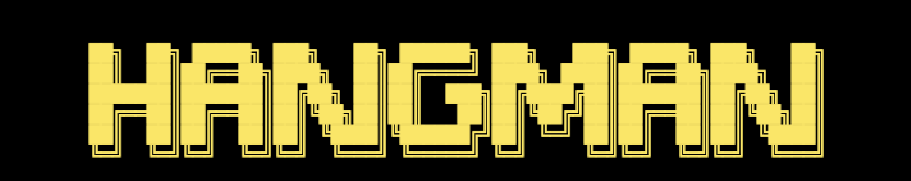

 
 
 

**TABLE OF CONTENTS**

- [**ABOUT PYFUN HANGMAN**](#about-pyfun-hangman)
- [**LOGIC CHART**](#logic-chart)
- [**USER STORIES**](#user-stories)
- [**INTRO SCREEN**](#intro-screen)
- [**ENTER NAME**](#enter-name)
- [**LET'S PLAY HANGMAN**](#let-s-play-hangman)
- [**INCORRECT GUESS**](#incorrect-guess)
- [**ALREADY GUESSED**](#already-guessed)
- [**INVALID GUESS**](#invalid-guess)
- [**CORRECT GUESS**](#correct-guess)
- [**WIN AND RELOAD**](#win-and-reload)
- [**LOSE AND RELOAD**](#lose-and-reload)
- [**FUTURE FEATURES**](#future-features)
- [**LANGUAGES USED**](#languages-used)
- [**RESOURCES**](#resources)
- [**MANUAL TESTING**](#manual-testing)
- [**AM I RESPONSIVE**](#am-i-responsive)
- [**VALIDATION**](#validation)
- [**BUGS**](#bugs)
- [**KNOWN ISSUES**](#known-issues)
- [**DEPLOYMENT**](#deployment)
- [**HOW TO FORK**](#how-to-fork)
- [**HOW TO CLONE**](#how-to-clone)
- [**VERSION CONTROL**](#version-control)
- [**CREDITS**](#credits)
- [**ACKNOWLEDGEMENTS**](#--acknowledgements)

 
 
 

# **ABOUT PYFUN HANGMAN**

This project is based on the classic pencil and paper game Hangman.
The user must guess the full word before hangman is hung. This is done by guessing a letter in the word.
If the guess is correct, it is placed in the blank spaces that make up the word but if the guess is incorrect the user loses a try and a section of the hangman is created. The word must be guessed before the user runs out of tries and the full hangman
drawing is displayed. The deloyed site can be found **[here](https://pyfun-hangman.herokuapp.com/)**.

 
 
 

# **LOGIC CHART**

 
 
 

# **USER STORIES**

**Visitor Goals**

* I want to be able to play the game quickly
* I want to understand how ot play the game
* I want to be able to play the game as many times as I like

 
 
 

# **INTRO SCREEN**

 
 
 

# **ENTER NAME**

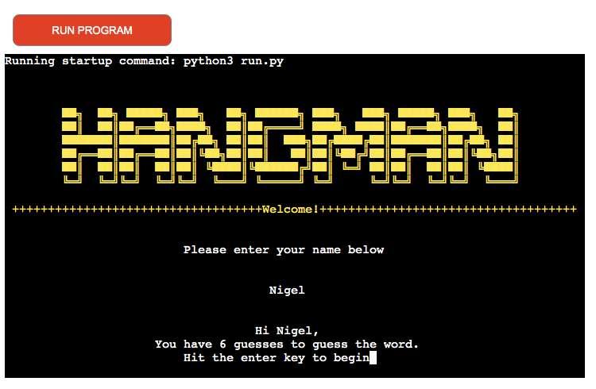

 
 
 

# **LET'S PLAY HANGMAN**

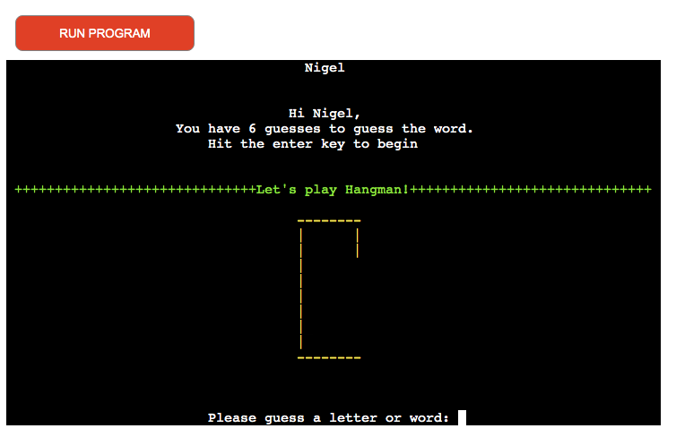

 
 
 

# **INCORRECT GUESS**

 
 
 

# **ALREADY GUESSED**

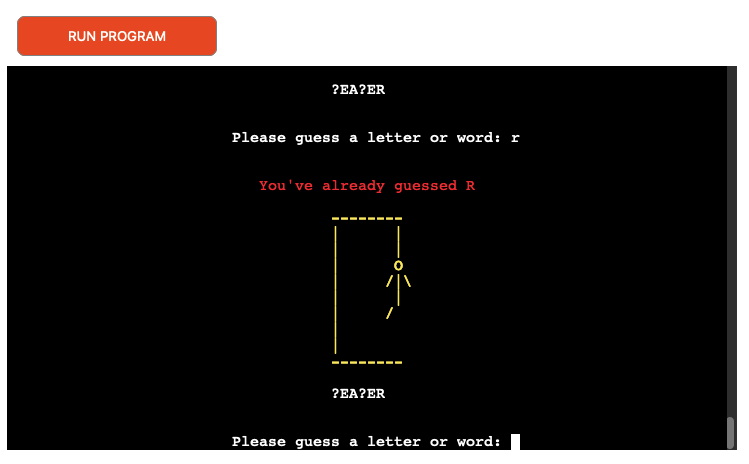

 
 
 

# **INVALID GUESS**

 
 
 

# **CORRECT GUESS**

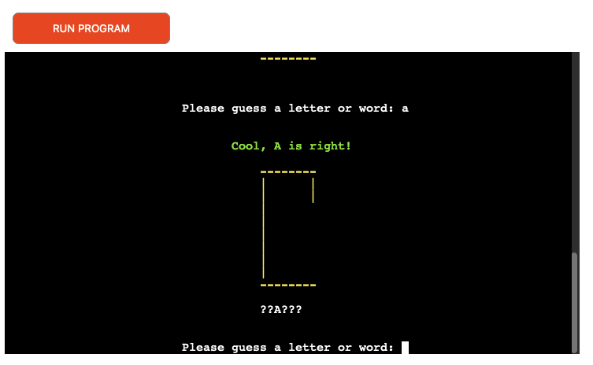

 
 
 

# **WIN AND RELOAD**

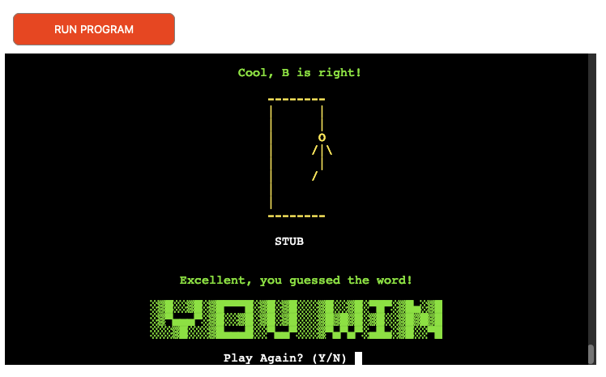

I hope that the user will want to play multiple times so on WIN a congratulations message will
pop-up with the option to try again.

 
 
 

# **LOSE AND RELOAD**

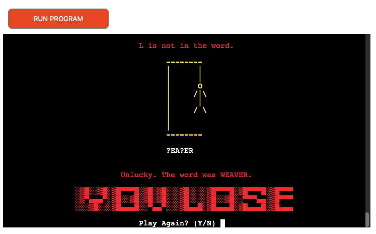

I hope that the user will want to play multiple times so on LOSE a message with the answer will
print with the option to try again.

 
 
 

# **FUTURE FEATURES**

* Add difficulty level option
* Add a scoring system and keep track of high scores
* Maybe add various language versions

 
 
 

# **LANGUAGES USED**

* Python
* Markdown

 
 
 

# **RESOURCES**

* **Gitpod** - to create the website and version control
* **Github** - to save and store the files for the website
* **Adobe Illustrator** - to create the logo and various headings
* **Am I Responsive** - to display the website on a range of devices
* **Texteditor.com** - for ASCII text art
* **Google Dev Tools** - for troubleshooting and testing fixes
* **CI Python Linter** - to test Python code
* **Slack, Stackoverflow, Youtube, Google, W3C Schools** - for help with troubleshooting errors
* **Coolors.co** - to check colour contrast
* **W3C Spell Checker** - to check website spelling
* **Freeconvert.com** - to compress mp4
* **Ezgif.com**- to convert compressed mp4 to gif for README
* **Record It Pro** - for screen-capturing video and converting mp4 to gif
* **GitHub Wiki TOC generator** - for generating README Table of Contents

 
 
 

# **MANUAL TESTING**
* I manually tested the game. I checked win, lose, play again and quit stages.
* I tested incorrect, invalid, duplicate and correct guesses.

 
 
 

# **VALIDATION**
**CI Python Linter**

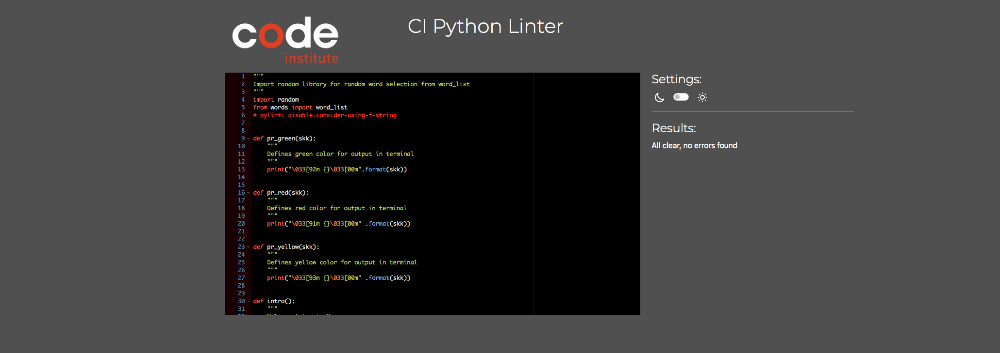

 
 
 

# **BUGS**

* **Expected** - when playing the game the classic hangman image would display as the players go through the tries.
* **Testing** - I ran the game using terminal. 
* **Result** - at certain stages the tries image wasn't displaying correctly.
* **Fix** - I had some spaces in the code that was causing the problem.

---

* **Expected** - when loaded the game display would be easy to read and navigate.
* **Testing** - I deployed the game to Heroku. 
* **Result** - once loaded the left aligned text seemed too close to edge of the window.
* **Fix** - I changed the code so the text content was centered in the window.

---

* **Expected** - when progressing through the game each section would be easy to follow.
* **Testing** - I deployed the game to Heroku. 
* **Result** - once loaded some of the sections seemed a bit cramped, new lines appearing directly underneath the preceding lines.
* **Fix** - I changed the code to add line spaces between the sections of the game to spread them out an making it easier on the eye.

---

* **Expected** - that the underscores used for the hangman guess-word would have a slight gap between them so it's obvious how many letters are in the word to be guessed.
* **Testing** - I deployed the game to Terminal where it looked ok and then deployed to Heroku. 
* **Result** - in Heroku the underscores merged into one line so it was hard to tell how many letters were in the guess word.
* **Fix** - I tried a few fixes but settled on changing from underscores to a question mark.

---

 
 
 

# **KNOWN ISSUES**

 
 
 

# **DEPLOYMENT**

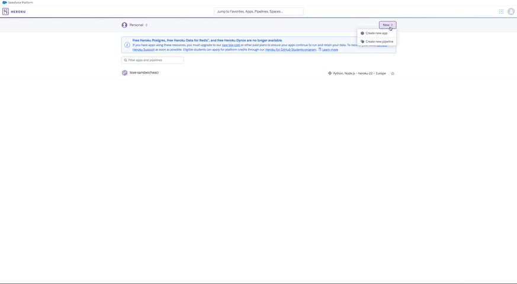
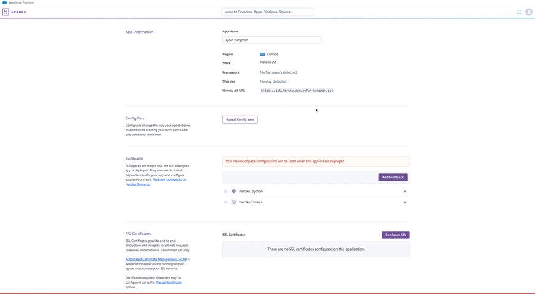
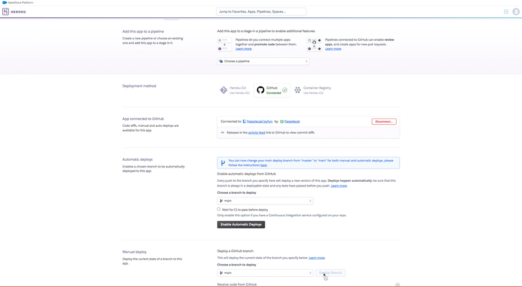

* The site was deployed on Heroku 

* Open Heroku account.
* From the Heroku dashboard click the “Create new app” button.
* Name the app, the name has to be unique.
* Select region and click “Create app”. 
* Click on the settings tab.  
* Click “Add buildpack” here.
* Select Python then click “Save changes”.
* Select node.js and click “Save” again.
* Buildpacks must be in this order, with Python on top and node.js underneath.
* Go to the deploy section.  
* Select Github and confirm that we want to connect to Github.  
* Search for the Github repository name and once found click “connect”  
* Choose to manually deploy using the deploy branch option.  
* After creation you get an “App was successfully deployed” message  
with a button to take us to our deployed link. 

 
 
 

# **HOW TO FORK**

* Login/signup to GitHub.

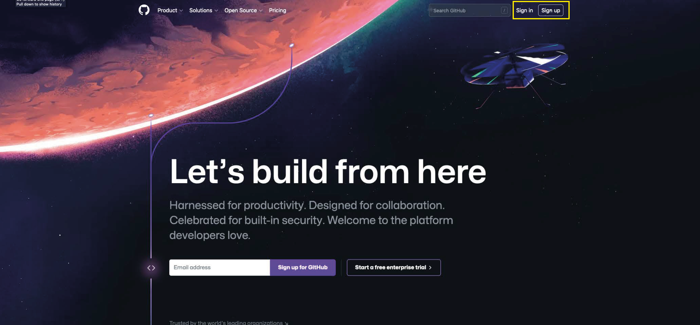
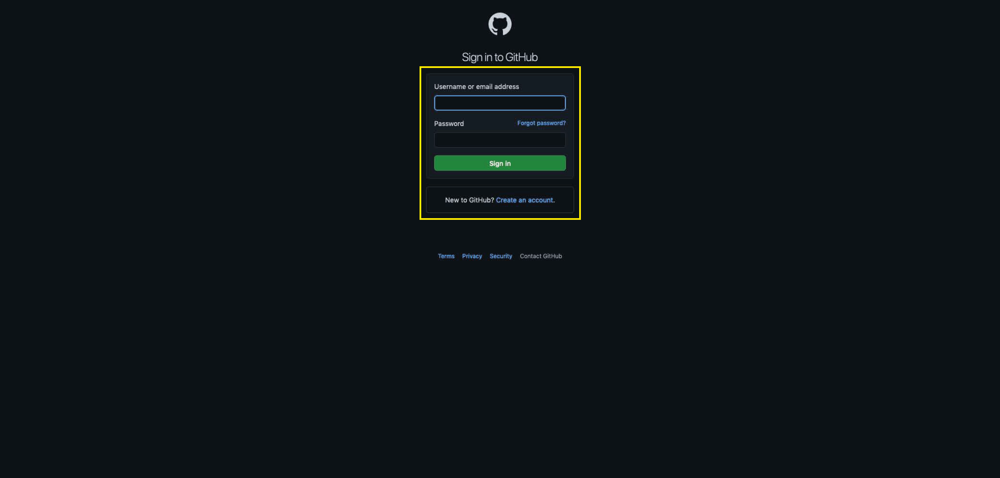

* Locate the relevant repository, for example: https://github.com/frapplecat/pyfun

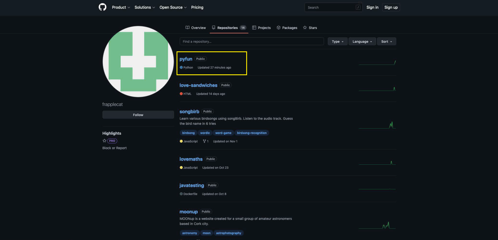

* Click on the 'Fork' button in the top right corner.

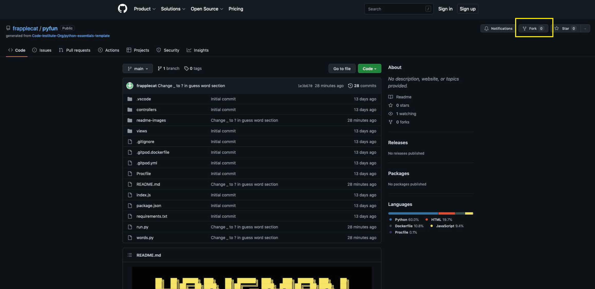

* The forked version of this repo will be generated.

 
 
 

# **HOW TO CLONE**

* On GitHub.com, navigate to the main page of the repository.
* Above the list of files, click  Code.
* Copy the URL for the repository.
* To clone the repository using HTTPS, under "HTTPS", click the clipboard icon for copying the URL.
* Open Terminal.
* Change the current working directory to the location where you want the cloned directory.
* Type git clone, and then paste the URL you copied earlier.
* $ git clone https://github.com/YOUR-USERNAME/YOUR-REPOSITORY
* Press Enter to create your local clone.

 
 
 

# **VERSION CONTROL**

I used GITPOD for version control software. Regular git add ., git commit -m, and git push were used to add, save and push the code to the GITHUB Reop where the source code is stored.

 
 
 

# **CREDITS**

* I watched many youtube tutorials on hangman games but in particular **[Kiteco](https://www.youtube.com/watch?v=m4nEnsavl6w)**
* For adding color to the terminal I referenced an article on **[Geeks for Geeks](https://www.geeksforgeeks.org/print-colors-python-terminal/)**
* For clear the terminal screen I referenced **[101 Computing](https://www.101computing.net/python-typing-text-effect/)**

 
 
 

# **ACKNOWLEDGEMENTS**

* Thanks as always to my Code Institute Mentor, Mitko Backvarov, for his support and encouragement.