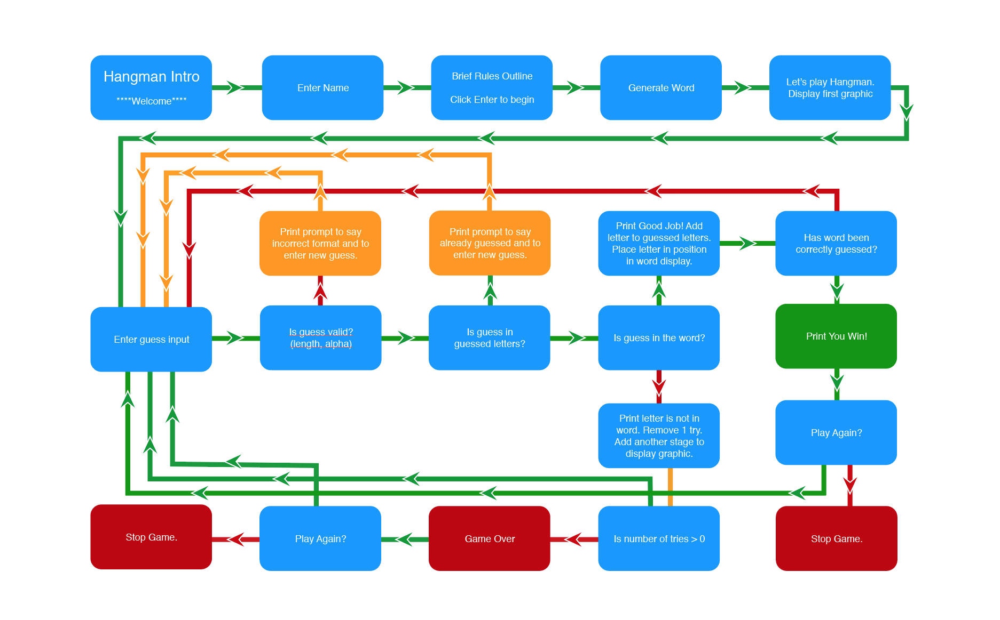
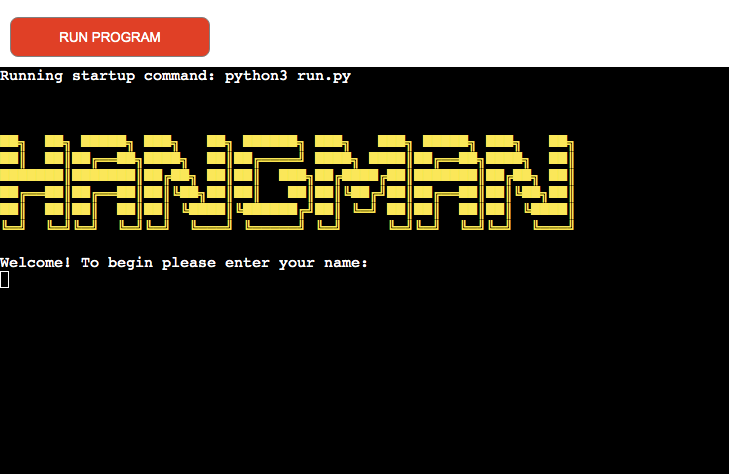
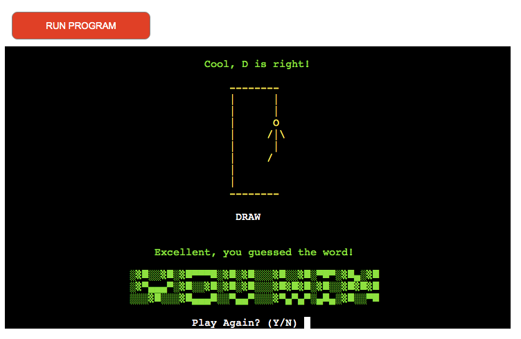
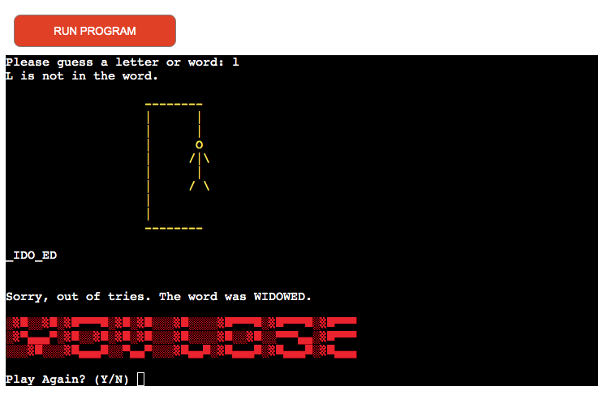

 
 
 

**TABLE OF CONTENTS**

 
 
 

# **ABOUT PYFUN HANGMAN**

This project is based on the classic pencil and paper game Hangman.
The user must guess the full word before hangman is hung. This is done by guessing a letter in the word.
If the guess is correct, it is placed in the blank spaces that make up the word but if the guess is incorrect the user loses a try and a section of the hangman is created. The word must be guessed before the user runs out of tries and the full hangman
drawing is displayed. 

 
 
 

# **LOGIC CHART**

 
 
 

# **USER STORIES**

**Visitor Goals**

* I want to be able to play the game quickly
* I want to understand how ot play the game
* I want to be able to play the game as many times as I like

 
 
 

# **INTRO SCREEN**

 
 
 

# **WIN AND RELOAD**

I hope that the user will want to play multiple times so on WIN a congratulations message will
pop-up with the option to try again.

 
 
 

# **LOSE AND RELOAD**

I hope that the user will want to play multiple times so on LOSE a message with the answer will
print with the option to try again.

 
 
 

# **FUTURE FEATURES**

* Add difficulty level option
* Add a scoring system and keep track of high scores

 
 
 

# **LANGUAGES USED**

* Python
* Markdown

 
 
 

# **RESOURCES**

* **Gitpod** - to create the website and version control
* **Github** - to save and store the files for the website
* **Adobe Illustrator** - to create the logo and various headings
* **Am I Responsive** - to display the website on a range of devices
* **Texteditor.com** - for ASCII text art
* **Google Dev Tools** - for troubleshooting and testing fixes
* **CI Python Linter** - to test Python code https://pep8ci.herokuapp.com/
* **Slack, Stackoverflow, Youtube, Google, W3C Schools** - for help with troubleshooting errors
* **Coolors.co** - to check colour contrast
* **W3C Spell Checker** - to check website spelling
* **Freeconvert.com** - to compress mp4
* **Ezgif.com**- to convert compressed mp4 to gif for README
* **Record It Pro** - for screen-capturing video and converting mp4 to gif
* **GitHub Wiki TOC generator** - for generating README Table of Contents

 
 
 

# **MANUAL TESTING**
* I manually tested the game, I checked win, lose, play again and quit stages.

 
 
 

# **AM I RESPONSIVE**

 
 
 

# **VALIDATION**
**CI Python Linter**

 
 
 

**Lighthouse**

 
 
 

# **BUGS**

* **Expected** - when playing the game the classic hangman image would display as the players go through the tries.
* **Testing** - I ran the game using terminal. 
* **Result** - at certain stages the tries image wasn't displaying correctly.
* **Fix** - I had some spaces in the code that was causing the problem.

---

* **Expected** - when.
* **Testing** - I ran the game using terminal. 
* **Result** - once.
* **Fix** - I.

---

 
 
 

# **KNOWN ISSUES**

* None so far

 
 
 

# **DEPLOYMENT**

* The site was deployed on Heroku 

* Open Heroku account.
* From the Heroku dashboard click the “Create new app” button.
* Name the app, the name has to be unique.
* Select region and click “Create app”. 
* Click on the settings tab.  
* Click “Add buildpack” here.
* Select Python then click “Save changes”.
* Select node.js and click “Save” again.
* Buildpacks must be in this order, with Python on top and node.js underneath.
* Go to the deploy section.  
* Select Github and confirm that we want to connect to Github.  
* Search for the Github repository name and once found click “connect”  
* Choose to manually deploy using the deploy branch option.  
* After creation you get an “App was successfully deployed” message  
with a button to take us to our deployed link. 

 
 
 

# **HOW TO FORK**

* Login/signup to GitHub.
* Locate the relevant repository, for example: https://github.com/frapplecat/pyfun
* Click on the 'Fork' button in the top right corner.
* The forked version of this repo will be generated.

 
 
 

# **HOW TO CLONE**

* On GitHub.com, navigate to the main page of the repository.
* Above the list of files, click  Code.
* Copy the URL for the repository.
* To clone the repository using HTTPS, under "HTTPS", click the clipboard icon for copying the URL.
* Open Terminal.
* Change the current working directory to the location where you want the cloned directory.
* Type git clone, and then paste the URL you copied earlier.
* $ git clone https://github.com/YOUR-USERNAME/YOUR-REPOSITORY
* Press Enter to create your local clone.

 
 
 

# **VERSION CONTROL**

I used GITPOD for version control software. Regular git add ., git commit -m, and git push were used to add, save and push the code to the GITHUB Reop where the source code is stored.

 
 
 

# **CREDITS**

* I watched many youtube tutorials on hangman games but in particular **[Kiteco](https://www.youtube.com/watch?v=m4nEnsavl6w)**
* For adding color to the terminal I referenced an article on **[Geeks for Geeks](https://www.geeksforgeeks.org/print-colors-python-terminal/)**

 
 
 

# **ACKNOWLEDGEMENTS**

* Thanks as always to my Code Institute Mentor, Mitko Backvarov, for his support and encouragement.

Welcome frapplecat,

This is the Code Institute student template for deploying your third portfolio project, the Python command-line project. The last update to this file was: **August 17, 2021**

## Reminders

* Your code must be placed in the `run.py` file
* Your dependencies must be placed in the `requirements.txt` file
* Do not edit any of the other files or your code may not deploy properly

## Creating the Heroku app

When you create the app, you will need to add two buildpacks from the _Settings_ tab. The ordering is as follows:

1. `heroku/python`
2. `heroku/nodejs`

You must then create a _Config Var_ called `PORT`. Set this to `8000`

If you have credentials, such as in the Love Sandwiches project, you must create another _Config Var_ called `CREDS` and paste the JSON into the value field.

Connect your GitHub repository and deploy as normal.

## Constraints

The deployment terminal is set to 80 columns by 24 rows. That means that each line of text needs to be 80 characters or less otherwise it will be wrapped onto a second line.

-----
Happy coding!