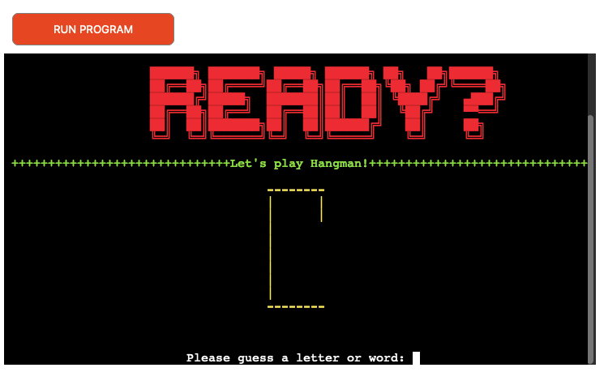
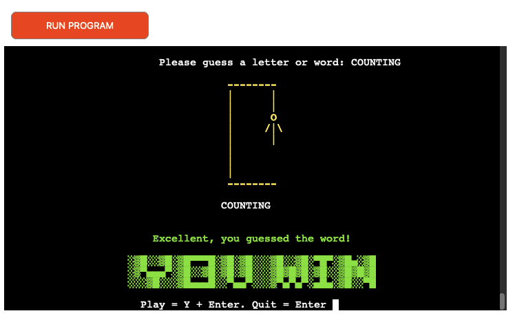
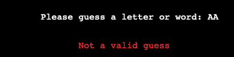

 
 
 

**TABLE OF CONTENTS**

- [**ABOUT PYFUN HANGMAN**](#about-pyfun-hangman)
- [**LOGIC CHART**](#logic-chart)
- [**USER STORIES**](#user-stories)
- [**INTRO SCREEN**](#intro-screen)
- [**ENTER NAME**](#enter-name)
- [**WELCOME SCREEN AND RULES**](#welcome-screen-and-rules)
- [**LET'S PLAY HANGMAN**](#lets-play-hangman)
- [**INCORRECT GUESS LETTER**](#incorrect-guess-letter)
- [**ALREADY GUESSED LETTER**](#already-guessed-letter)
- [**INVALID GUESS LETTER**](#invalid-guess-letter)
- [**CORRECT GUESS LETTER**](#correct-guess-letter)
- [**INCORRECT GUESS WORD**](#incorrect-guess-word)
- [**ALREADY GUESSED WORD**](#already-guessed-word)
- [**CORRECT GUESS WORD**](#correct-guess-word)
- [**WIN AND RELOAD**](#win-and-reload)
- [**LOSE AND RELOAD**](#lose-and-reload)
- [**END GAME AND GOODBYE**](#end-game-and-goodbye)
- [**FUTURE FEATURES**](#future-features)
- [**LANGUAGES USED**](#languages-used)
- [**RESOURCES**](#resources)
- [**MANUAL TESTING**](#manual-testing)
- [**VALIDATION**](#validation)
- [**BUGS**](#bugs)
- [**KNOWN ISSUES**](#known-issues)
- [**DEPLOYMENT**](#deployment)
- [**HOW TO FORK**](#how-to-fork)
- [**HOW TO CLONE**](#how-to-clone)
- [**VERSION CONTROL**](#version-control)
- [**CREDITS**](#credits)
- [**ACKNOWLEDGEMENTS**](#acknowledgements)

 
 
 

# **ABOUT PYFUN HANGMAN**

This project is based on the classic pencil and paper game Hangman.
The user must guess the full word before hangman is hung. This is done by guessing a letter in the word.
If the guess is correct it is placed into position in the line of question marks below the hangman graphic but if the guess is incorrect the user loses a try and a section of the hangman is created. The word must be guessed before the user runs out of tries and the full hangman drawing is displayed. The deloyed site can be found **[here](https://pyfun-hangman.herokuapp.com/)**.

 
 
 

# **LOGIC CHART**

 
 
 

# **USER STORIES**

**Visitor Goals**

* I want to be able to play the game quickly
* I want to understand how to play the game
* I want a user friendly interface
* I want to be able to play the game as many times as I like

 
 
 

# **INTRO SCREEN**

*  Some ASCII text displays for the game title intro

 
 
 

# **ENTER NAME**

* A prompt to enter your name and hit enter

 
 
 

# **WELCOME SCREEN AND RULES**

* A welcome message using the enter name info and a quick outline of the rules. Click Enter to begin.

 
 
 

# **LET'S PLAY HANGMAN**

* Let's Play! Enter a letter or word guess.

 
 
 

# **INCORRECT GUESS LETTER**

* If a letter guessed is not in the word then a red 'incorrect guess' message displays. The letter is added to the guessed list.
One try is removed from the total number of attempts and a stage of the hangman graphic is added to the display.

 
 
 

# **ALREADY GUESSED LETTER**

* If a letter guessed has already been tried then a red 'already guessed' message displays.

 
 
 

# **INVALID GUESS LETTER**

* If a user input is not in required format a red 'not a valid guess' message displays.

 
 
 

# **CORRECT GUESS LETTER**

* If a letter guessed is correct then a green 'letter is correct' message displays. The letter is added to the guessed list.

 
 
 

# **INCORRECT GUESS WORD**

* If a word guessed is not the word then a red 'incorrect guess' message displays. The word is added to the guessed list.
One try is removed from the total number of attempts and a stage of the hangman graphic is added to the display.

 
 
 

# **ALREADY GUESSED WORD**

* If a word guessed has already been tried then a red 'already guessed' message displays.

 
 
 

# **CORRECT GUESS WORD**

* If a word guessed is correct then a green 'YOU WIN, you guessed the word' message displays.

 
 
 

# **WIN AND RELOAD**

* I hope that the user will want to play multiple times so on WIN a congratulations message will
pop-up with the option to try again.

 
 
 

# **LOSE AND RELOAD**

* I hope that the user will want to play multiple times so on LOSE a message with the answer will
print with the option to try again.

 
 
 

# **END GAME AND GOODBYE**

* If Quit is selected a Goodbye message appears in the display window.

 
 
 

# **FUTURE FEATURES**

* Add difficulty level option
* Add a scoring system and keep track of high scores
* Add a different language version

 
 
 

# **LANGUAGES USED**

* Python
* Markdown

 
 
 

# **RESOURCES**

* **Gitpod** - to create the website and version control
* **Github** - to save and store the files for the website
* **Adobe Illustrator** - to create the logo and various headings
* **Texteditor.com** - for ASCII text art
* **CI Python Linter** - to test Python code
* **Slack, Stackoverflow, Youtube, Google, W3C Schools** - for help with troubleshooting errors
* **Freeconvert.com** - to compress mp4
* **Ezgif.com**- to convert compressed mp4 to gif for README
* **Record It Pro** - for screen-capturing video and converting mp4 to gif
* **GitHub Wiki TOC generator** - for generating README Table of Contents

 
 
 

# **MANUAL TESTING**
I manually tested the game constantly during it's creation using the gitpod terminal.
I checked enter name, rules, win, lose, play again and quit stages. I tested incorrect, invalid, duplicate and correct guesses.
I checked the various inputs worked as expected. I tested the Y/N replay game section.

Once I was happy with the game was functioning as I'd hoped I deployed to Herouku.

I started testing using the same methods as outlined above in the deployed app and noticed some elements that didn't work as well
as when viewed in the gitpod terminal.

The left alignmment in gitpod terminal seemed perfectly viable to me from a user point of 
view but looked cramped when I tried using the deployed version and felt in impacted negatively on the 
user experience.

 
 

I decided to change the alignment to a more centered layout as I felt that led to a better user experience.

Similarly the underscores I'd used for the guess-word looked ok in gitpod terminal, having a little separation
between the underscores, but once deployed in Heroku the underscores appeared as a single line which also impacted the 
user experience as it was hard to tell the word length. I tried a few variants such as increasing the space between the underscores 
but eventually decided to replace the underscores with question marks.

I noticed other user experience issues more in the deloyed app than during the intial testing in gitpod terminal.
So I reworked the code, adding more color areas, extra spaces and clear terminal functions to make playing the 
game, to my eyes at least, a more pleasant experience and less cluttered than the first deployments.

 

|**FEATURE**|**EXPECTED**|**ACTION**|**RESULT**|**SCREENSHOT**|
|:---|:---|:---|:---|:---|
| Intro | To display on load | Run game | As expected | 
| Enter Name | To appear underneath title | Input alphanumeric name, hit enter | As expected | 
| Welcome Heading | To display after clear screen from enter name | None needed | As expected | 
| Welcome Text and Rules | To display message using username input | None needed | As expected | 
| Begin Game | To display below rules | Hit enter to begin game | As expected | 
| Ready? | To display after clear screen from previous input | None needed | As expected | 
| Let's Play Hangman | To display first stage of game below Ready? heading | None needed | As expected | 
| Guess Correct | To display green message saying guess is correct, replaces ? with letter, adds letter to guessed list | User must input a letter guess | As expected | 
| Guess Incorrect | To display red message saying guess is not in the word, adds letter to guessed list | User must input a letter guess | As expected |
| Guess Invalid | To display red message saying guess is not valid, prompt to enter letter or word | User has input an invalid letter guess e.g too many letters or a number | As expected |
| Guessed Already | To display red message saying already guessed using info from guessed list and a prompt to enter a letter | User has input letter already guessed | As expected |
| Word Guess Incorrect | To display red message if the word guessed was incorrect and a prompt to enter a letter or word | User has input incorrect word guess | As expected |
| Word Guess Correct | To display green message if the word guessed was correct | User has input the correct word | As expected |
| Word Guessed Already | To display red message saying already guessed this word using info from guessed word list and a prompt to enter a letter | User has input word already guessed | As expected |
| Hangman Graphic | With each failed guess a section of the graphic is added to the screen | User inputs a letter guess with each attempt | As expected | 
| Win | If the user guesses the word before the graphic is complete a You Win message is printed alongside a play or quit question | User to input Y + enter to play again or just hit Enter to quit | As expected | 
| Lose | If the user uses all attempts and fails to guess the word before the graphic is complete a You Lose message is printed alongside a play again prompt | User to input Y + enter to play again or just hit Enter to quit | As expected | 
| Play Again? Y | If Y + Enter is used the game returns to the Ready? screen and the first hangman graphic. A new word has been randomly selected.  | User requested to input Y + Enter | As expected | 
| Quit? | If Y is not input and Enter used it will end the game with a Goodbye message | User requested to hit Enter| As expected | 

 
 
 

# **VALIDATION**
**CI Python Linter**

 
 
 

# **BUGS**

* **Expected** - when playing the game the classic hangman image would display as the players go through the tries.
* **Testing** - I ran the game using terminal. 
* **Result** - at certain stages the tries image wasn't displaying correctly.
* **Fix** - I had some spaces in the code that was causing the problem.

---

* **Expected** - when loaded the game display would be easy to read and navigate.
* **Testing** - I deployed the game to Heroku. 
* **Result** - once loaded the left aligned text seemed too close to edge of the window.
* **Fix** - I changed the code so the text content was centered in the window.

---

* **Expected** - when progressing through the game each section would be easy to follow.
* **Testing** - I deployed the game to Heroku. 
* **Result** - once loaded some of the sections seemed a bit cramped, new lines appearing directly underneath the preceding lines.
* **Fix** - I changed the code to add line spaces between the sections of the game to spread them out an making it easier on the eye.

---

* **Expected** - that the underscores used for the hangman guess-word would have a slight gap between them so it's obvious how many letters are in the word to be guessed.
* **Testing** - I deployed the game to Terminal where it looked ok and then deployed to Heroku. 
* **Result** - in Heroku the underscores merged into one line so it was hard to tell how many letters were in the guess word.
* **Fix** - I tried a few fixes but settled on changing from underscores to a question mark.

---

 
 
 

# **KNOWN ISSUES**
No known issues
 
 
 

# **DEPLOYMENT**

* The site was deployed on Heroku 

* Open Heroku account.
* From the Heroku dashboard click the “Create new app” button.
* Name the app, the name has to be unique.
* Select region and click “Create app”. 
* Click on the settings tab.  
* Click “Add buildpack” here.
* Select Python then click “Save changes”.
* Select node.js and click “Save” again.
* Buildpacks must be in this order, with Python on top and node.js underneath.
* Go to the deploy section.  
* Select Github and confirm that we want to connect to Github.  
* Search for the Github repository name and once found click “connect”  
* Choose to manually deploy using the deploy branch option.  
* After creation you get an “App was successfully deployed” message  
with a button to take us to our deployed link. 

 
 
 

# **HOW TO FORK**

* Login/signup to GitHub.

 
 

* Locate the relevant repository, for example: https://github.com/frapplecat/pyfun

 
 

* Click on the 'Fork' button in the top right corner.

 
 

* The forked version of this repo will be generated.

 
 
 

# **HOW TO CLONE**

* On GitHub.com, navigate to the main page of the repository.

 
 

* Above the list of files, click Code.

 
 

* Copy the URL for the repository.

 
 

* Open Terminal.

 
 

* Change the current working directory to the location where you want the cloned directory.
* Type git clone, and then paste the URL you copied earlier.

 
 

* Press Enter to create your local clone.

 
 
 

# **VERSION CONTROL**

I used GITPOD for version control software. Regular git add ., git commit -m, and git push were used to add, save and push the code to the GITHUB Repo where the source code is stored.

 
 
 

# **CREDITS**

* I watched many youtube tutorials on hangman games but in particular **[Kiteco](https://www.youtube.com/watch?v=m4nEnsavl6w)**
* For adding color to the terminal I referenced an article on **[Geeks for Geeks](https://www.geeksforgeeks.org/print-colors-python-terminal/)**
* For clear the terminal screen function I referenced **[101 Computing](https://www.101computing.net/python-typing-text-effect/)**

 
 
 

# **ACKNOWLEDGEMENTS**

* Thanks as always to my Code Institute Mentor, Mitko Backvarov, for his support, advice and encouragement.